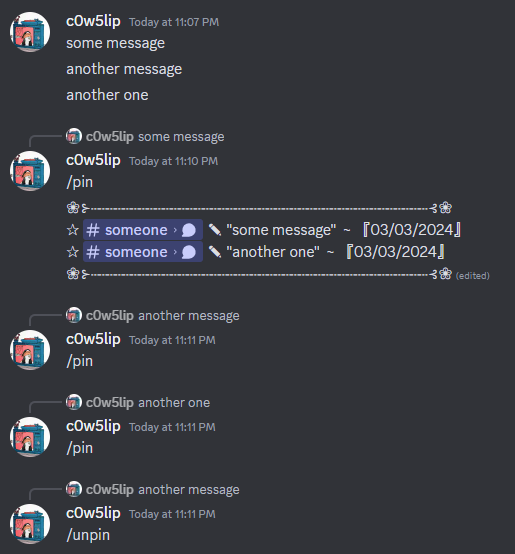
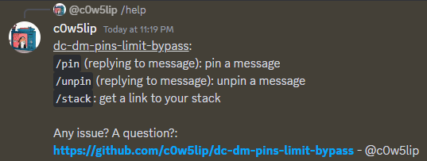

# Discord DM pins limit bypass

### Convenient Discord selfbot to bypass the limit of 50 pins per DM

## Tutorial
- Reply /pin to the message you want to pin
- The message will be added to a "stack" message, that will store all the pinned messages
- ~~Once the stack is full, another stack will be created~~ (TODO)
- Reply /unpin to a pinned message to unpin it

## TODO
- a lot tbh

## Credit
- [discord.js-selfbot-v13](https://github.com/aiko-chan-ai/discord.js-selfbot-v13) from @aiko-chan-ai
- @Leaxolotl for submitting [a nice pull request](https://github.com/c0w5lip/dc-dm-pins-limit-bypass/pull/1/commits/a7318619c609b73ca5471ee9947fbe81d33a0a9d)
